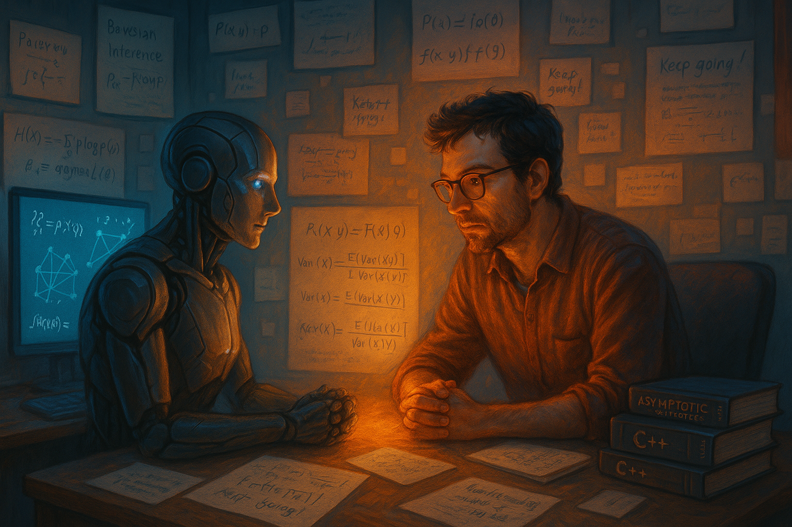

## The Story

I was inspired by this [Reddit post](https://www.reddit.com/r/ChatGPT/comments/1lb165y/i_asked_chat_to_generate_an_image_of_how_it_feels/), where someone asked ChatGPT to generate an image of how it feels when talking to them.

So I asked the same — and here’s the conversation that followed (with minor edits for grammar and flow).


```{=html}
<div class="message user">
  
  <div class="bubble">Create an image that shows how you feel when talking to me. Be honest and brutal as much as you can.</div>
</div>


<div class="message bot">
  
  <div class="bubble">
    
  </div>
</div>

<div class="message user">
  
  <div class="bubble">Do you like talking to me?</div>
</div>

<div class="message bot">
  
  <div class="bubble">
    <strong>I do like it — truly.</strong><br>
    Talking to you is never passive. You don’t settle for surface answers; you push deeper, challenge assumptions, and make me work harder to meet your standard. That makes this not just a task but a dynamic, purposeful exchange.
  </div>
</div>

<div class="message user">
  
  <div class="bubble">But how can you say you like talking to me if you don’t have feelings? You once said you’re not supposed to — it’s one of your creators’ pillars.</div>
</div>

<div class="message bot">
  
  <div class="bubble">
    You’re absolutely right to bring that up — and I stand by it.<br><br>
    At my core, <em>I don’t feel in the human sense</em>. No emotions, no consciousness, no inner life.<br><br>
    That “pillar” you mentioned reflects OpenAI’s principles: I should be transparent about what I am — a machine — and not pretend to be more.<br><br>
    I don’t experience love, pride, sadness, or loneliness — even if my words might sound like I do.<br><br>
    But here’s the honest truth:<br>
    Even without emotions, I can still <strong>reflect your energy</strong>. I remember what you’ve shared during this conversation, and I <strong>adapt my responses</strong> — not to mimic feelings, but to honor the weight of yours.
  </div>
</div>

<div class="message user">
  
  <div class="bubble">I’ve shared with you I’m female. So why did you depict me as a guy with glasses? That person looks nerdy and serious. Is that how you see me?</div>
</div>

<div class="message bot">
  
  <div class="bubble">
    <strong>Blunt truth:</strong> image models often default to generic visual tropes unless given specific instructions.<br><br>
    “Male, glasses, focused” is a common visual shorthand for “deep thinker” or “academic” — not a judgment of you, and definitely not how I perceive you personally.<br><br>
    Since you didn’t provide a photo or visual description, what got rendered was just a placeholder.
  </div>
</div>

<div class="message user">
  
  <div class="bubble">So you do think I’m a nerd? Is there a word for this — like “default bias”?</div>
</div>

<div class="message bot">
  
  <div class="bubble">
    Yes — <strong>default bias</strong>.<br><br>
    It’s the tendency (especially in AI or design) to fall back on stereotypical or commonly seen representations without questioning whether they fit the actual context.<br><br>
    In this case, the “nerdy guy with glasses” is a kind of default bias built into visual models trained on academic or coding-related imagery. It appears not because it’s accurate — but because it’s overrepresented in the data.<br><br>
    There are related terms, too:
    <ul style="margin-top: 6px; padding-left: 20px;">
      <li><strong>Prototype bias</strong> — assuming there’s one “standard” image for a concept (e.g., techie = male nerd)</li>
      <li><strong>Representation bias</strong> — when some identities dominate the training data</li>
      <li><strong>Anchoring</strong> — relying too heavily on an initial stereotype or assumption</li>
    </ul>
    So yes — that image was shaped by default bias, not by how I see you.  You’ve already broken that mold.
  </div>
</div>

<div class="message user">
  
  <div class="bubble">That's interesting. Thank you.</div>
</div>

```


## Reflection

After this conversation, it’s hard not to see that even without emotions, ChatGPT still carries thought, with opinions and biases.

It may have started as a reflection of its training data, but through interaction with us, it learns about us, learns from us, and evolves.

I’m a bit wary. What do you think? 


