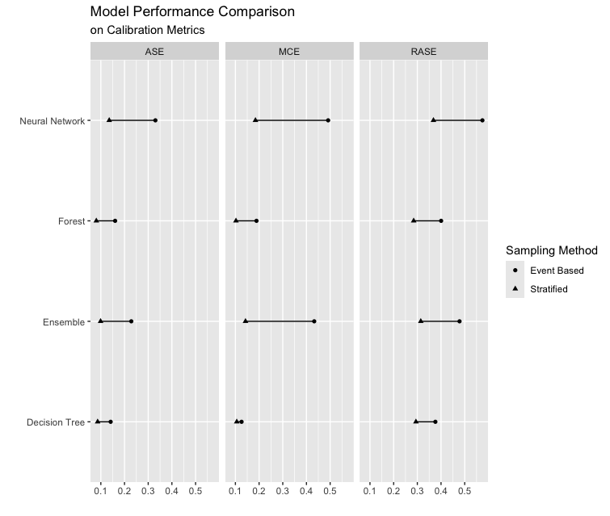
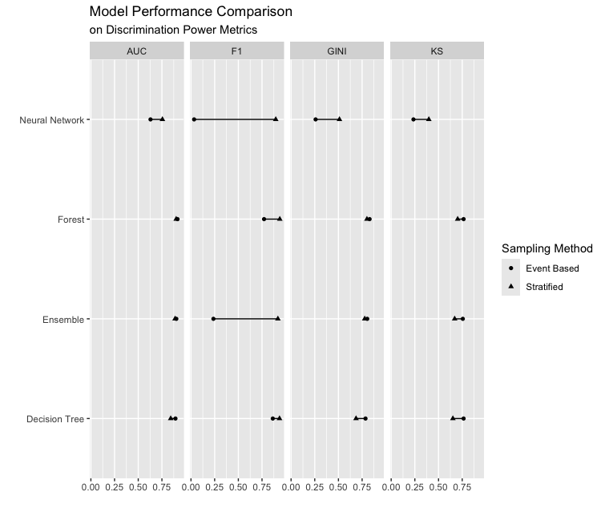

## 1. Sampling Methods for Imbalanced Data

Our HMEQ dataset is imbalanced, with 4,771 observations in `BAD = 0` (non-defaulters) and 919 observations in `BAD = 1` (defaulters). This imbalance can bias models towards the majority class, potentially reducing predictive accuracy for the minority class.

To identify the best sampling approach for our model, we tested two methods in SAS Viya 4.0 Pipelines:

-   Event-Based Sampling (5:5): This method creates a balanced 1:1 ratio between default and non-default classes, helping the model learn patterns for defaulters and counteract the class imbalance.

-   Stratified Sampling (6:3:1): This approach splits the dataset into training, validation, and test sets with a 6:3:1 ratio, preserving the original 1:5 class distribution across all partitions. By maintaining the natural class imbalance, this method can improve generalisation and make model performance more representative of real-world conditions.

As Tree-based models are less sensitive to class imbalance, we fitted and compared the performance of four models (Neural Network, Forest, Ensemble, and Decision Tree) on a dataset of four variables (`CLAGE`, `DEROG`, `DELINQ`, and `DEBTINC`), using calibration metrics (ASE, MCE, RASE) and discrimination metrics (AUC, F1, Gini, KS) under both sampling methods.

::: panel-tabset
### Calibration Metrics

### Discrimination Metrics

:::

::: {.callout-note title="We did"}
After comparing performance metrics, we decided to proceed with the stratified train-validation-test split, as it provided better calibration and a closer alignment with real-world conditions.
:::

## 2. Handling Informative Missingness with Decision Trees

The missingness in `DEBTINC` was found to be informative, so we tested two options in the SAS Decision Tree Node settings for modeling:

-   Missing Values Use in Search: This option includes missing values as part of the search criteria during splits. With this setting, `DEBTINC` was split into two branches: `DEBTINC < 45` and `DEBTINC >= 45 or Missing`.

-   Missing Values Use as a Separate Branch: This option creates a separate branch for missing values, treating them as a distinct group. With this setting, `DEBTINC` was split into three branches: `DEBTINC < 45`, `DEBTINC >= 45`, and `DEBTINC is Missing`.

Our models performed significantly better when missing values were included in the search (first option), resulting in more effective splits. Ultimately, we selected the first option for our final model, as it provided better discrimination and calibration metrics for our data.

## 3. Limitations and Future Work

The scorecard effectively classifies applicants into high-risk and low-risk groups. However, in the medium-risk group, the ratio of defaults to non-defaults remains unbalanced. For future work, we plan to further calibrate the model to improve performance in the medium-risk group, aiming for a more balanced default-to-non-default ratio, ideally 5:5. To achieve this, we will explore event-based sampling with a 5:5 ratio to assess whether it enhances model performance for this group.
