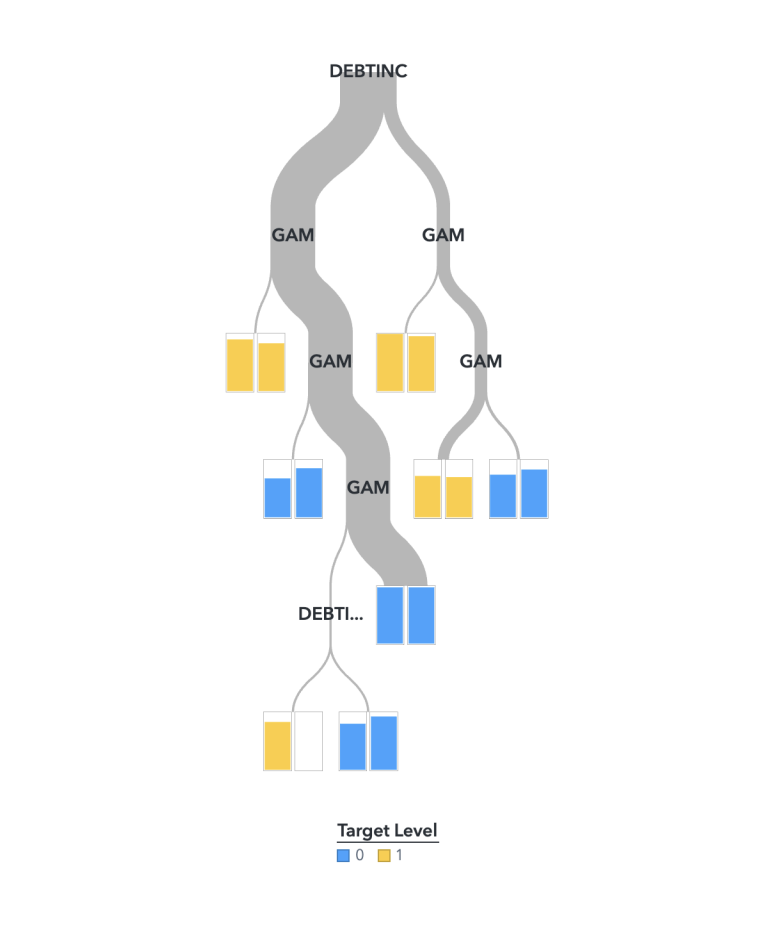

::: {.callout-note collapse="true" title="Discimination and Calibration Metrics"}
**Discrimination Metrics** (higher values indicate better discrimination):

-   `KS`: Kolmogorov-Smirnov statistic, with values above 0.60 indicating strong discrimination.

-   `Gini`: Measures discriminatory power in credit scoring.

-   `AUC`: Area Under the Curve, assessing the model's ability to distinguish between classes.

-   `F1`: Harmonic mean of precision and recall, representing accuracy.

**Calibration Metrics** (lower values indicate better calibration):

-   `RASE`: Root Average Squared Error.

-   `MCE`: Misclassification Error.

-   `ASE`: Average Squared Error.
:::

After imputation on `DEROG`, `DELINQ`, `CLAGE` is complete, we proceed with model building, selection, and evaluation using SAS Viya Pipelines. To ensure interpretability for scorecard development, we focused on logistic regression, generalised additive models (GAM), and decision trees. However, `DEBTINC` has missing values, preventing its use with logistic regression or GAM, and decision trees offer only moderate interpretability. Thus, we adopted the following approach:

::: panel-tabset
### Hybrid GAM-Decision Tree Model

We first fit a GAM on `IMP_CLAGE`, `IMP_DEROG`, and `IMP_DELINQ` (imputed versions of `CLAGE`, `DEROG`, and `DELINQ`) to obtain log-odds for these variables. We use these log-odds to engineer a new feature, `GAM`. We then fit a decision tree using `GAM` and `DEBTINC`.

### Model Evaluation

![In this figure, we compared our hybrid model performance with less interpretable models (Ensemble, Random Forest, Neural Network) on the same set of predictors (`IMP_CLAGE`, `IMP_DEROG`, `IMP_DELINQ`, and `DEBTINC`). While our hybrid GAM-Decision Tree model ranks around the average level among models in this assessment, its overall performance is strong, with an F1 score of 0.86 and a KS value of 0.68, indicating high accuracy and solid discrimination power. Given its interpretability, this model is the optimal choice for scorecard development.](pic/Stratified%20Split%20Model%20Comparison.png)
:::
