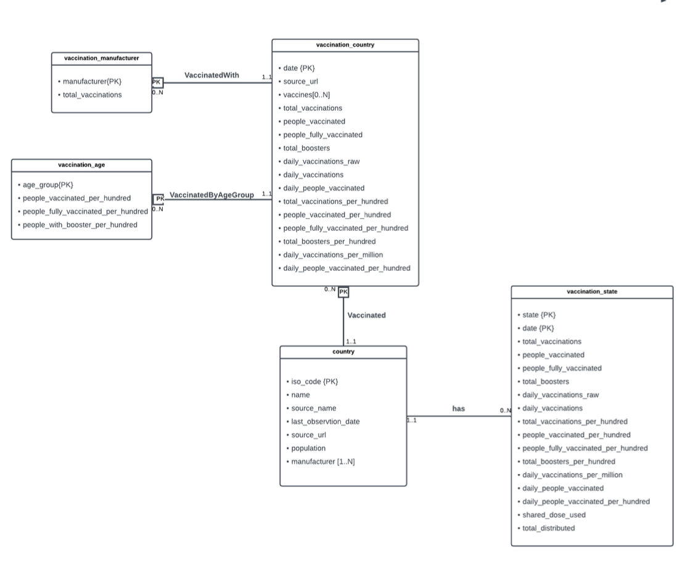

```{r include=FALSE}
library(dplyr)
library(ggplot2)
library(readr)
library(plotly)
library(forcats)

quest1 <- read_csv("covid/data/quest1.csv")
quest2 <- read_csv("covid/data/quest3.csv")

```


::: callout-note
This task involves designing and populating a relational database on the global COVID-19 vaccination campaign to enable efficient insights and analysis. The database includes tables for countries, states, vaccination data, and vaccine manufacturers, focusing on metrics such as the number of people vaccinated, vaccine types, and age groups. 

- Designed the database schema through **E-R modelling**, **schema decomposition**, and **normalization** (3NF) to optimize structure for query efficiency.  
- **Cleaned and processed** heterogeneous CSV datasets to populate the database according to the defined schema.  
- Developed **advanced SQL queries** (CTEs, window functions, date transformations) to extract insights on vaccination trends, coverage, and manufacturer distribution, and presented results through **data visualizations** for comparative analysis.
:::


## ERD

Data for this task was provided in multiple CSV files from [Our World in Data](https://docs.owid.io/projects/etl/api/covid/).

ERD (Entity-Relationship Diagram) of the original data is provided below:



## Database Schema

The database schema is fully normalized and defined in SQLite syntax (adaptable to other SQL databases). Data from CSV files was cleaned and transformed using R tidyverse, and the final [`Vaccinations.db`](covid/data/Vaccinations.db) file is available for download.

| Table Name | Key Columns (PK) | Other Columns | Foreign Keys |
|--------------|--------------|-----------------------------|-----------------|
| **country** | `iso_code` | `country`, `population`, `source_name` | — |
| **state** | `state` | `iso_code` | `iso_code` → country(`iso_code`) |
| **country_latest_source** | `iso_code`, `last_observation_date` | `source_website` | `iso_code` → country(`iso_code`) |
| **vaccination_country** | `iso_code`, `date` | `source_url`, `total_vaccinations`, `people_vaccinated`, `people_fully_vaccinated`, `total_boosters`, `daily_vaccinations_raw`, `daily_vaccinations`, `daily_people_vaccinated` | `iso_code` → country(`iso_code`) |
| **vaccination_manufacturer** | `manufacturer`, `iso_code`, `date` | `total_vaccinations` | (`iso_code`, `date`) → vaccination_country(`iso_code`, `date`) |
| **vaccination_age** | `age_group`, `iso_code`, `date` | `people_vaccinated_per_hundred`, `people_fully_vaccinated_per_hundred`, `people_with_booster_per_hundred` | (`iso_code`, `date`) → vaccination_country(`iso_code`, `date`) |
| **vaccination_state** | `state`, `date` | `total_vaccinations`, `people_vaccinated`, `people_fully_vaccinated`, `total_boosters`, `daily_vaccinations_raw`, `daily_vaccinations`, `total_vaccinations_per_hundred`, `people_vaccinated_per_hundred`, `people_fully_vaccinated_per_hundred`, `total_boosters_per_hundred`, `daily_vaccinations_per_million`, `share_doses_used`, `total_distributed` | `state` → state(`state`) |


```{sql eval=FALSE}
CREATE TABLE country (
    iso_code    TEXT    NOT NULL,
    country     TEXT,
    population  INTEGER,
    source_name TEXT,
    PRIMARY KEY (
        iso_code
    )
);


CREATE TABLE state (
    state    TEXT NOT NULL,
    iso_code TEXT,
    PRIMARY KEY (
        state
    ),
    FOREIGN KEY (
        iso_code
    )
    REFERENCES country (iso_code) 
);


CREATE TABLE country_lastest_source (
    iso_code              TEXT NOT NULL,
    last_observation_date TEXT,
    source_website,
    PRIMARY KEY (
        iso_code,
        last_observation_date
    ),
    FOREIGN KEY (
        iso_code
    )
    REFERENCES country (iso_code) 
);


CREATE TABLE vaccination_country (
    iso_code                TEXT    NOT NULL,
    date                    TEXT    NOT NULL,
    source_url              TEXT,
    total_vaccinations      INTEGER,
    people_vaccinated       INTEGER,
    people_fully_vaccinated INTEGER,
    total_boosters          INTEGER,
    daily_vaccinations_raw  INTEGER,
    daily_vaccinations      INTEGER,
    daily_people_vaccinated INTEGER,
    PRIMARY KEY (
        iso_code,
        date
    ),
    FOREIGN KEY (
        iso_code
    )
    REFERENCES country (iso_code) 
);


CREATE TABLE vaccination_manufacturer (
    manufacturer       TEXT    NOT NULL,
    iso_code           TEXT    NOT NULL,
    date               TEXT    NOT NULL,
    total_vaccinations INTEGER,
    PRIMARY KEY (
        manufacturer,
        iso_code,
        date
    ),
    FOREIGN KEY (
        iso_code,
        date
    )
    REFERENCES vaccination_country (iso_code,
    date) 
);


CREATE TABLE vaccination_age (
    age_group                           TEXT  NOT NULL,
    iso_code                            TEXT  NOT NULL,
    date                                TEXT  NOT NULL,
    people_vaccinated_per_hundred       FLOAT,
    people_fully_vaccinated_per_hundred FLOAT,
    people_with_booster_per_hundred     FLOAT,
    PRIMARY KEY (
        age_group,
        iso_code,
        date
    ),
    FOREIGN KEY (
        iso_code,
        date
    )
    REFERENCES vaccination_country (iso_code,
    date) 
);


CREATE TABLE vaccination_state (
    state                               TEXT    NOT NULL,
    date                                TEXT    NOT NULL,
    total_vaccinations                  INTEGER,
    people_vaccinated                   INTEGER,
    people_fully_vaccinated             INTEGER,
    total_boosters                      INTEGER,
    daily_vaccinations_raw              INTEGER,
    daily_vaccinations                  INTEGER,
    total_vaccinations_per_hundred      FLOAT,
    people_vaccinated_per_hundred       FLOAT,
    people_fully_vaccinated_per_hundred FLOAT,
    total_boosters_per_hundred          FLOAT,
    daily_vaccinations_per_million      FLOAT,
    share_doses_used                    FLOAT,
    total_distributed                   FLOAT,
    PRIMARY KEY (
        state,
        date
    ) FOREIGN KEY (state) REFERENCES state (state)
);
```

## Insights

### Query 1: Vaccination Progress among Countries

The following query provides the running total of the number of people who have taken the vaccine so far for each observation day recorded in each countries around the world.

```{sql eval=FALSE}
WITH quest1_view AS (
    SELECT vc.iso_code,
           c.country,
           vc.date,
           ROW_NUMBER() OVER (PARTITION BY vc.iso_code ORDER BY vc.date) - 1 AS dateNo,
           vc.people_vaccinated
      FROM vaccination_country vc
           JOIN
           country c ON vc.iso_code = c.iso_code
)
SELECT country,
       dateNo AS DayNO,
       people_vaccinated AS [Total Injected People]
  FROM quest1_view
 WHERE people_vaccinated != "NA" AND 
       people_vaccinated != 0;
```

```{r echo=FALSE}
(quest1 |>
    filter(grepl("income", country, ignore.case = TRUE)) |>
    ggplot(aes(
      x = DayNO,
      y = `Total Injected People`,
      color = country
    )) +
    geom_line() +
    labs(
      x = "Day",
      y = "Total Injected People",
      title = "Comparison of Vaccination Progress by Income Segment",
      color = ""
    ) +
    theme_minimal() +
    theme(
      legend.position = "bottom",
      axis.text.y = element_blank()
    )) |>
  ggplotly(tooltip = c("x", "y"))

```

### Query 2: Covid-19 Vaccines Popularity

The Covid-19 vaccination campaign has seen the use of various vaccines across different countries. The following query provides insights into the adoption of these vaccines globally, showing the number of countries that have administered each type of vaccine.

```{sql eval=FALSE}
SELECT c.country AS [Country/Region],
       MAX(vc.total_vaccinations) AS [Cummulative Doses]
  FROM vaccination_country vc
       JOIN
       country c ON vc.iso_code = c.iso_code
 WHERE vc.total_vaccinations != "NA"
 GROUP BY vc.iso_code
 ORDER BY MAX(vc.total_vaccinations) DESC;
```

```{r echo=FALSE}
(quest2 |> 
  count(`Vaccine Type`)  |>                                    # get frequency
  mutate(`Vaccine Type` = fct_reorder(`Vaccine Type`, n)) |> # sort by freq
  ggplot(aes(
    x = `Vaccine Type`,
    y = n,
    text = paste("Used by", n, "countries")                   # hover text
  )) +
  geom_col(fill = "#1f78b4") +
  coord_flip() +
  labs(
    x = "",
    y = "",
    title = "Global Popularity of COVID-19 Vaccines",
    subtitle = "Number of countries and regions administering each vaccine",
  ) +
  theme(
    axis.text.y = element_text(hjust = 0, margin = margin(r = 10)),
    axis.ticks = element_blank()
  )
) |> ggplotly(tooltip = "text")

```
